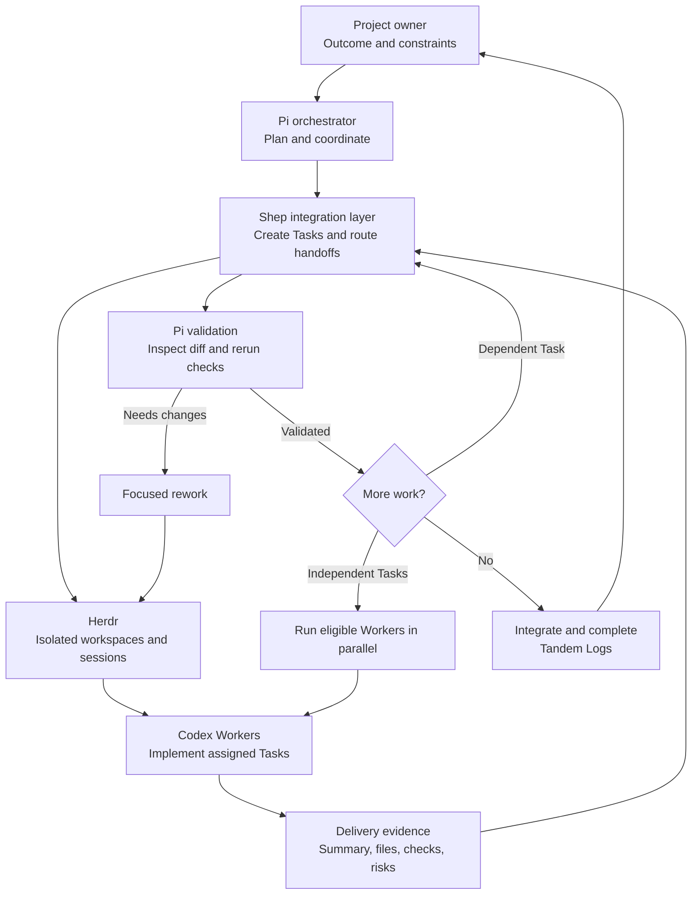

A fully agentic workflow lets the project owner delegate implementation and review work without manually driving every step. The owner still defines the outcome and keeps final responsibility for the project. Pi acts as the orchestrator, Herdr provides the workspace and worker sessions, Codex performs delegated work, and the Shep integration layer connects those sessions to Tandem tasks and accords.

The workflow is repeatable:

1. **Define the outcome.** The project owner describes the result, constraints, and acceptance criteria in a Tandem Task. The task is the durable source of scope.
2. **Plan the delegation.** Pi reads the task, its related context, and the active workspace rules. It divides the outcome into independently reviewable Tasks. A worker may use first-class Subtasks as its sequential checklist, but Subtasks are not separate delegation roots.
3. **Start workers.** Shep asks Herdr to create an isolated workspace for each delegated Task and starts a Codex Worker there. Workers can run one after another when a later task depends on an earlier result, or in parallel when the tasks are independent.
4. **Work in isolation.** Each Codex Worker changes only its assigned checkout. Herdr retains the session and workspace so progress, files, and the final handoff stay connected to the Task.
5. **Deliver evidence.** A Worker reports a concise summary, changed files, validation commands and results, deliverables, risks, and blockers. Shep records the delivery against the accord and moves the Task to `validation`.
6. **Validate and continue.** Pi inspects the handoff and the diff, then runs any independent checks. It accepts objective work when the criteria and evidence are satisfied. If the result needs changes, it sends focused rework. If the next Task depends on this one, Pi starts it only after validation.
7. **Close the loop.** Accepted work is integrated by the project owner or orchestrator and completed into Tandem Logs. The log preserves what changed and the evidence used to validate it.

## How the pieces fit

## Sequential or parallel delegation

Use **sequential delegation** when tasks have a real dependency. For example, one Worker can implement a protocol change, Pi can validate its evidence, and a second Worker can build the adapter on the validated behavior. Pass the first delivery and its acceptance criteria into the second Task rather than relying on an informal chat message.

Use **parallel delegation** when tasks touch separate areas or have a stable shared interface. For example, independent documentation pages can be assigned to separate Workers at the same time. Pi should wait for every required delivery, inspect each result, and resolve conflicts before integration.

Do not parallelize work that edits the same lines, depends on an unvalidated API, or has an unclear ownership boundary. Isolation prevents accidental edits, but it does not remove dependency or merge risk.

## What makes delivery trustworthy

A Worker saying “done” is not validation. A useful delivery gives the orchestrator enough evidence to reproduce the decision:

- **Summary:** what changed and how it meets the Task.
- **Files:** exact paths changed by the Worker.
- **Validation:** commands run and their results.
- **Risks:** known limitations, compatibility concerns, or follow-up work.
- **Blockers:** unresolved conditions that prevent completion.

Tandem keeps workflow state, accord status, and review status separate. Delivery records the Worker’s evidence; validation records the orchestrator’s judgment. A claimed accord is not acceptance, and automated checks do not replace review of the scope and diff.

## A practical operating rule

Keep the owner’s decisions at the orchestration boundary and keep implementation inside Workers. Pi should make dependencies, evidence, and next actions explicit. Shep should transport structured Task and accord information rather than reimplementing Tandem’s protocol. Herdr should manage the retained sessions and isolated workspaces. Codex should report work in the required handoff format. This separation makes a workflow fully agentic without making it opaque.
