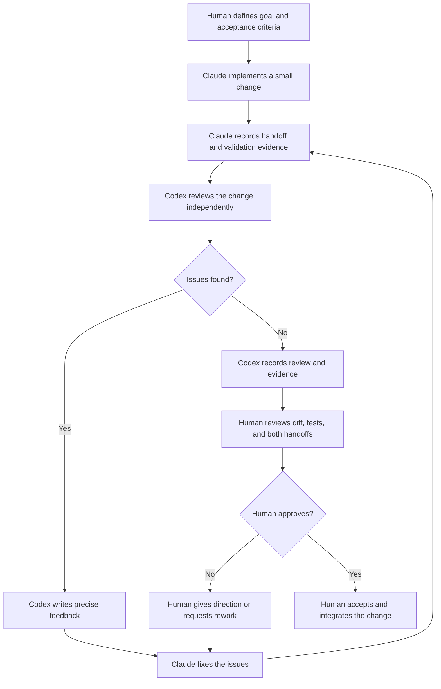

A human-in-the-loop workflow keeps implementation fast without making an agent the final judge of its own work. Claude and Codex take turns implementing and reviewing the change. A human reviews the evidence and decides whether the result is ready to ship.

This is an **adversarial** workflow: each reviewer looks for mistakes, missing requirements, and unsafe assumptions instead of trying to confirm the previous agent's conclusion.

## The workflow at a glance



The loop can start with either agent. The important boundaries are that implementation and review are separate turns, and that the human owns the final approval.

## 1. Define the decision the human will make

Before an agent changes code, the human states the goal and the acceptance criteria. Keep the criteria concrete. For example:

- the new command accepts the documented flags;
- invalid input returns a useful error;
- existing behavior remains unchanged;
- the relevant tests pass.

The human should also name anything that needs special care, such as compatibility, security, data migration, or a user-facing behavior change. Agents can then validate against a shared target instead of inventing one.

## 2. Claude implements and hands off

Claude makes the smallest complete change that meets the criteria. It should explain the change in a short handoff that another agent can act on without reconstructing the session.

A useful handoff contains:

- **Scope:** what changed and what did not change.
- **Files:** the exact paths that changed.
- **Validation:** commands run and their results.
- **Open questions:** assumptions, limitations, or known risks.
- **Review request:** the areas where Codex should be especially skeptical.

The handoff is evidence, not approval. A passing test proves only what that test covers.

## 3. Codex reviews independently

Codex reads the acceptance criteria, the diff, and Claude's validation evidence. It should inspect the implementation before relying on the summary. Ask questions such as:

- Does the change satisfy every acceptance criterion?
- What input or failure path is not covered?
- Could this break an existing caller or data format?
- Do the tests check behavior, or only implementation details?
- Is the code more complex or broad than the task requires?

Codex records findings by severity. Each finding should include the affected file or behavior, why it matters, and a specific way to verify or correct it. If there are no findings, it should say what it checked and which commands support that conclusion.

A review is not a second implementation turn. Codex should not silently edit the change while reviewing it. Clear separation makes the feedback auditable and gives the next implementer a stable target.

## 4. Feed feedback back to the implementer

If Codex finds an issue, Claude addresses the feedback and creates a new handoff. The new handoff should identify:

- each finding that was addressed;
- the exact fix;
- any test added or rerun;
- findings that were intentionally not changed, with a reason.

Codex then reviews the updated diff. Repeat this loop until the review has no blocking findings or the human changes the scope. Do not treat “no findings” as permission to skip the human decision.

## 5. The human makes the final decision

The human reviews the current diff and the complete evidence trail:

1. Compare the result with the original acceptance criteria.
2. Check Claude's implementation handoff and Codex's review.
3. Run or inspect any human-required checks, such as a browser, terminal, or product check.
4. Decide to approve, request rework, narrow the scope, or stop the change.

Only the human approves integration. The human may accept a documented risk, request another review angle, or reject both agents' conclusions. Record that decision where the project normally records approvals, along with any remaining risks.

## A compact handoff template

Use a stable format so the next participant can start quickly:

```text
TASK: task-N
SUMMARY: What changed and why.
FILES: Exact changed paths.
VALIDATION: Commands run and results.
FEEDBACK: Findings addressed, or “none”; include severity and paths.
RISKS: Known limitations and assumptions.
REQUEST: What the next reviewer or human should decide.
```

Keep implementation details in the diff and keep the handoff focused on decisions and evidence. A concise handoff is easier to challenge than a long narrative.

## Guardrails

- Give both agents the same acceptance criteria and the current diff.
- Prefer different models, prompts, or perspectives for implementation and review.
- Keep credentials, destructive commands, deployments, and irreversible migrations behind explicit human approval.
- Never copy a reviewer's “looks good” statement as the only evidence.
- Re-run validation after every substantive fix.
- Make unresolved disagreement visible to the human instead of resolving it by consensus between agents.

The goal is not to remove human judgment. It is to spend that judgment at the point where it has the most leverage: deciding whether the evidence supports integration.
